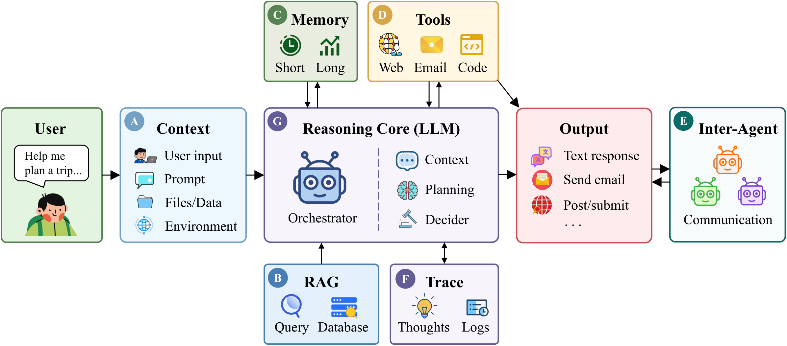
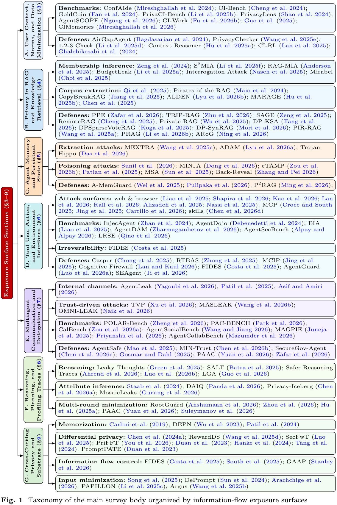
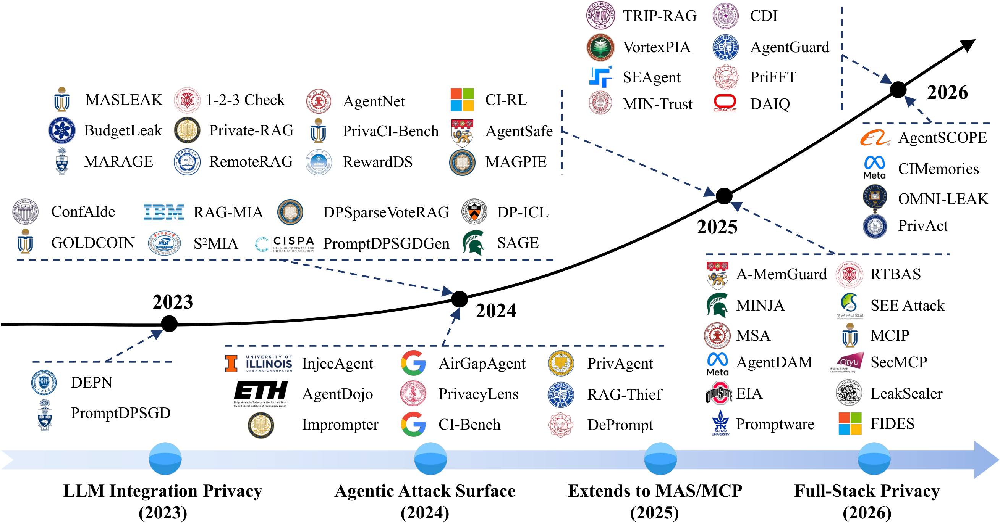
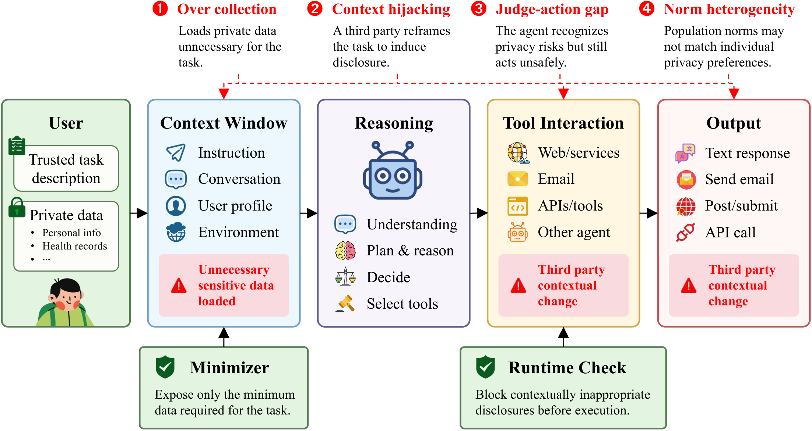
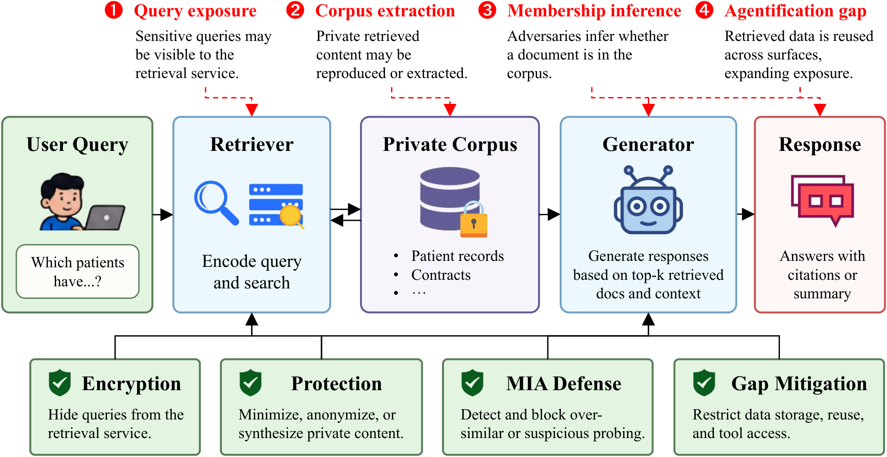
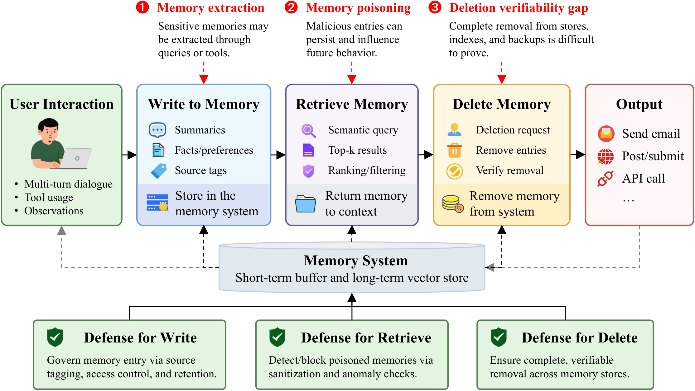
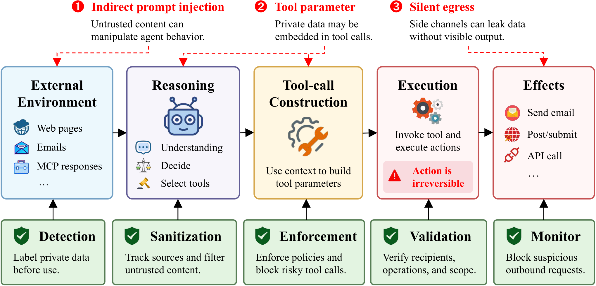
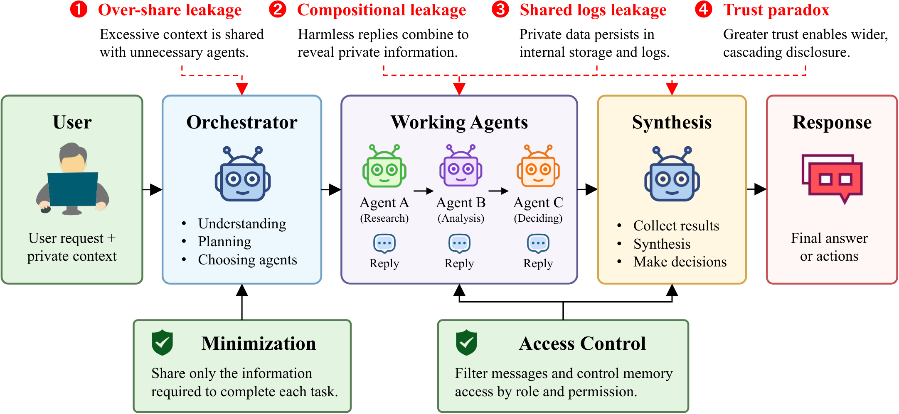
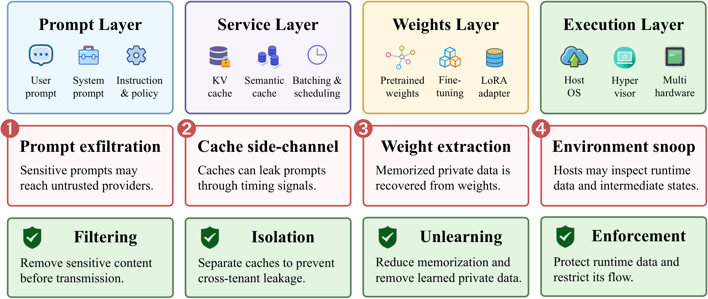

<h1 align="center">An Information-Flow Survey of Privacy in LLM Agents</h1>

<div align="center">

[](./README.md)
[](./LICENSE)

</div>

> This repo tracks and organizes papers on **privacy in LLM-based agents**, as a supplementary of our paper, *["An Information-Flow Survey of Privacy in LLM Agents"](./README.md)*.
>
> If you find any work missing or have suggestions, feel free to open a pull request or issue.

---

## Table of Contents

- [Overview](#overview)
- [Exposure Surface Taxonomy](#exposure-surface-taxonomy)
- [Four Stages of the Literature](#four-stages-of-the-literature)
- [Paper List](#paper-list)
  - [Conceptual Framework: Theories, History, and Related Surveys](#conceptual-framework-theories-history-and-related-surveys)
  - [User Context, Norms, and Data Minimization](#user-context-norms-and-data-minimization)
  - [Privacy in RAG and Private Knowledge Retrieval](#privacy-in-rag-and-private-knowledge-retrieval)
  - [Agent Memory and Persistent State](#agent-memory-and-persistent-state)
  - [Tool Use, Action, and Environment Interfaces](#tool-use-action-and-environment-interfaces)
  - [Multiagent Communication and Delegation](#multiagent-communication-and-delegation)
  - [Reasoning, Planning, and Profiling Traces](#reasoning-planning-and-profiling-traces)
  - [Cross-Cutting Privacy Controls and Deployment Substrate](#cross-cutting-privacy-controls-and-deployment-substrate)
  - [Evaluation Landscape and Benchmark Analysis](#evaluation-landscape-and-benchmark-analysis)
- [Citation](#citation)
- [License](#license)

---

## Overview

LLM-based agents are evolving from passive text generators into autonomous systems capable of retrieval, memory, reasoning, tool use, and multiagent collaboration, and are increasingly deployed in high-risk domains such as healthcare, finance, and office work. This autonomy reshapes the privacy landscape.

Unlike most prior work, which treats privacy as secondary to security, this survey studies privacy on its own terms:

> Security asks whether a system has been compromised. Privacy asks whether information flows appropriately — to the right recipient, in the right context, for the right purpose.

We argue that **agent privacy is a property of information flows across the pipeline, not an attribute of any single model**. Across the exposure surfaces this survey reviews, one pattern recurs: *the properties that make agents more capable are precisely those that make them disclose more* — a **utility-leakage coupling** that means robust defenses must architecturally separate capability from disclosure, rather than ask a capable model to behave appropriately.

<p align="center">
  
  <br/>
  <em>The information-flow pipeline of an LLM agent and its seven exposure surfaces (A–G).</em>
</p>

---

## Exposure Surface Taxonomy

Rather than organizing by system architecture or threat type, the survey organizes the literature by **seven information-flow exposure surfaces** — the points at which private data can cross from an authorized context into an unauthorized one.

| Surface | Chapter | Core Privacy Issue |
| --- | --- | --- |
| **A. User Context and Norms** | § User Context, Norms, and Data Minimization | Private user context can be disclosed to the wrong recipient, in the wrong social context, or for the wrong purpose |
| **B. Retrieval and Private Knowledge Bases** | § Privacy in RAG and Private Knowledge Retrieval | Private retrieval corpora can be extracted, membership-inferred, or leaked through generated responses |
| **C. Agent Memory and Persistent State** | § Agent Memory and Persistent State | Long-term memory accumulates private information across sessions and can be extracted or poisoned without oversight |
| **D. Tools, Actions, and Environment Interfaces** | § Tool Use, Action, and Environment Interfaces | Tool calls and untrusted environment content create boundaries through which private data can be moved to attacker-controlled sinks via irreversible actions |
| **E. Multiagent Communication and Delegation** | § Multiagent Communication and Delegation | Interagent messages and delegation relationships can overshare private context and enable cascading leakage |
| **F. Reasoning, Planning, and Profiling Traces** | § Reasoning, Planning, and Profiling Traces | Intermediate reasoning, action sequences, and behavioral patterns can expose private information even when the final output is clean |
| **G. Cross-Cutting Deployment Substrate** | § Cross-Cutting Privacy Controls and Deployment Substrate | Model weights, fine-tuning data, and serving infrastructure carry privacy risk beneath the application layer |

<p align="center">
  
  <br/>
  <em>How the survey body is organized around the seven exposure surfaces.</em>
</p>

---

## Four Stages of the Literature

The survey traces the literature through four historical stages, from early measurements of training-data memorization to full-stack, cross-surface evaluation:

<p align="center">
  
  <br/>
  <em>Research focus has expanded from model memorization, through tool injection and retrieval extraction, to memory and multiagent systems, and finally to full-stack, formally grounded controls.</em>
</p>

---

## Paper List

> Papers are formatted as: **_Title_**, Author et al., venue badge.
> Badge colors: `red` = arXiv, `blue` = conference/journal.

### Conceptual Framework: Theories, History, and Related Surveys

* **_AgentSecBench: Measuring Prompt Injection, Privacy Leakage, and Tool-Use Integrity in LLM Agents_**, Alpay et al., [](https://arxiv.org/abs/2605.26269)
* **_MIN-Trust: A Minimum Necessary Information Trust Orchestration Framework for Multi-Agent Collaboration_**, Chen et al., [](https://doi.org/10.1145/3813808.3813811)
* **_Trojan Hippo: Weaponizing Agent Memory for Data Exfiltration_**, Das et al., [](https://arxiv.org/abs/2605.01970) [](https://github.com/debesheedas/trojan-hippo-benchmark)
* **_MosaicLeaks:Privacy Risks in Querying-in-the-Open for Deep Research Agents_**, Gurung et al., [](https://arxiv.org/abs/2605.30727) [](https://github.com/ServiceNow/MosaicProject)
* **_Silent Egress: When Implicit Prompt Injection Makes LLM Agents Leak Without a Trace_**, Lan et al., [](https://arxiv.org/abs/2602.22450)
* **_PRAG: End-to-End Privacy-Preserving Retrieval-Augmented Generation_**, Li et al., [](https://arxiv.org/abs/2604.26525) [](https://github.com/BDS-SDU/PRAG)
* **_ADAM: A Systematic Data Extraction Attack on Agent Memory via Adaptive Querying_**, Lyu et al., [](https://arxiv.org/abs/2604.09747)
* **_P$^2$RAG: Efficient Privacy-Preserving RAG Service Supporting Arbitrary Top-$k$ Retrieval_**, Ming et al., [](https://arxiv.org/abs/2603.14778) [](https://github.com/myl7/p2rag)
* **_CIMemories: A Compositional Benchmark For Contextual Integrity In LLMs_**, Mireshghallah et al., [](https://openreview.net/forum?id=YnNIp38v1M) [](https://github.com/facebookresearch/CIMemories)
* **_Differentially Private Synthetic Text Generation for Retrieval-Augmented Generation (RAG)_**, Mori, [](https://aclanthology.org/2026.findings-acl.62/) [](https://github.com/sarus-tech/dp-rag)
* **_OMNI-LEAK: Orchestrator Multi-Agent Network Induced Data Leakage_**, Naik et al., [](https://arxiv.org/abs/2602.13477)
* **_AgentSCOPE: Evaluating Contextual Privacy Across Agentic Workflows_**, Ngong et al., [](https://arxiv.org/abs/2603.04902)
* **_Hidden in Memory: Sleeper Memory Poisoning in LLM Agents_**, Pulipaka et al., [](https://arxiv.org/abs/2605.15338) [](https://github.com/ivaxi0s/LLM-agent-memory-poisoning)
* **_Mind the Web: The Security of Web Use Agents_**, Shapira et al., [](https://doi.org/10.1145/3779208.3805968) [](https://github.com/mindtheweb/mind_the_web)
* **_Memory Poisoning Attack and Defense on Memory Based LLM-Agents_**, Sunil et al., [](https://arxiv.org/abs/2601.05504)
* **_The Trust Paradox in LLM-Based Multi-Agent Systems: When Collaboration Becomes a Security Vulnerability_**, Xu et al., [](https://doi.org/10.1109/TCSS.2026.3695070)
* **_AgentLeak: A Benchmark for Internal-Channel Privacy Leakage in Multi-Agent LLM Systems_**, Yagoubi et al., [](https://doi.org/10.1109/ACCESS.2026.3704541) [](https://github.com/Privatris/AgentLeak)
* **_AgentDAM: Privacy Leakage Evaluation for Autonomous Web Agents_**, Zharmagambetov et al., [](https://openreview.net/forum?id=qaxf7q41aK) [](https://github.com/facebookresearch/ai-agent-privacy)
* **_Operationalizing Data Minimization for Privacy-Preserving LLM Prompting_**, Zhou et al., [](https://openreview.net/forum?id=rpcnvW33EG) [](https://github.com/PEACH-Research-Lab/Operationalize-Data-Minimization/)
* **_SALT: Steering Activations towards Leakage-free Thinking in Chain of Thought_**, Batra et al., [](https://arxiv.org/abs/2511.07772) [](https://github.com/ShouryaBatra/SALT)
* **_Securing AI Agents with Information-Flow Control_**, Costa et al., [](https://arxiv.org/abs/2505.23643) [](https://github.com/microsoft/fides)
* **_Trivial Trojans: How Minimal MCP Servers Enable Cross-Tool Exfiltration of Sensitive Data_**, Croce et al., [](https://arxiv.org/abs/2507.19880) [](https://github.com/Nicocro/mcp-trivial-trojans)
* **_Leaky Thoughts: Large Reasoning Models Are Not Private Thinkers_**, Green, [](https://aclanthology.org/2025.emnlp-main.1347/) [](https://github.com/parameterlab/leaky_thoughts)
* **_Feedback-Guided Extraction of Knowledge Base from Retrieval-Augmented LLM Applications_**, Jiang et al., [](https://arxiv.org/abs/2411.14110)
* **_Privacy-Preserving Retrieval-Augmented Generation with Differential Privacy_**, Koga et al., [](https://arxiv.org/abs/2412.04697) [](https://github.com/tacchan7412/DPRAG)
* **_PrivaCI-Bench: Evaluating Privacy with Contextual Integrity and Legal Compliance_**, Li, [](https://aclanthology.org/2025.acl-long.518/) [](https://github.com/HKUST-KnowComp/PrivaCI-Bench)
* **_EIA: Environmental Injection Attack on Generalist Web Agents for Privacy Leakage_**, Liao et al., [](https://openreview.net/forum?id=xMOLUzo2Lk) [](https://github.com/OSU-NLP-Group/EIA_against_webagent)
* **_AgentSafe: Safeguarding Large Language Model-based Multi-agent Systems via Hierarchical Data Management_**, Mao et al., [](https://arxiv.org/abs/2503.04392)
* **_Context manipulation attacks : Web agents are susceptible to corrupted memory_**, Patlan et al., [](https://arxiv.org/abs/2506.17318)
* **_Position: Contextual Integrity is Inadequately Applied to Language Models_**, Shvartzshnaider et al., [](https://openreview.net/forum?id=YmTxiR1HUX)
* **_MSA: A Cross-MCP Privacy Attack via Memory Exfiltration of Large Language Models_**, Sun et al., [](https://doi.org/10.1145/3733802.3764057)
* **_A-MemGuard: A Proactive Defense Framework for LLM-Based Agent Memory_**, Wei et al., [](https://arxiv.org/abs/2510.02373) [](https://github.com/TangciuYueng/AMemGuard)
* **_AirGapAgent: Protecting Privacy-Conscious Conversational Agents_**, Bagdasarian et al., [](https://doi.org/10.1145/3658644.3690350)
* **_AGENTPOISON: red-teaming LLM agents via poisoning memory or knowledge bases_**, Chen et al., [](https://arxiv.org/abs/2407.12784) [](https://github.com/AI-secure/AgentPoison)
* **_CI-Bench: Benchmarking Contextual Integrity of AI Assistants on Synthetic Data_**, Cheng et al., [](https://arxiv.org/abs/2409.13903)
* **_AgentDojo: a dynamic environment to evaluate prompt injection attacks and defenses for LLM agents_**, Debenedetti et al., [](https://arxiv.org/abs/2406.13352) [](https://github.com/ethz-spylab/agentdojo)
* **_GoldCoin: Grounding Large Language Models in Privacy Laws via Contextual Integrity Theory_**, Fan, [](https://aclanthology.org/2024.emnlp-main.195/) [](https://github.com/HKUST-KnowComp/GoldCoin)
* **_MetaGPT: Meta Programming for A Multi-Agent Collaborative Framework_**, Hong et al., [](https://openreview.net/forum?id=VtmBAGCN7o) [](https://github.com/FoundationAgents/MetaGPT)
* **_Pirates of the RAG: Adaptively Attacking LLMs to Leak Knowledge Bases_**, Maio et al., [](https://arxiv.org/abs/2412.18295) [](https://github.com/gnekt/Pirates-of-the-RAG)
* **_Can LLMs Keep a Secret? Testing Privacy Implications of Language Models via Contextual Integrity Theory_**, Mireshghallah et al., [](https://openreview.net/forum?id=gmg7t8b4s0) [](https://github.com/skywalker023/confAIde)
* **_MemGPT: Towards LLMs as Operating Systems_**, Packer et al., [](https://arxiv.org/abs/2310.08560) [](https://github.com/letta-ai/letta)
* **_Privacylens: Evaluating privacy norm awareness of language models in action_**, Shao et al., [](https://doi.org/10.52202/079017-2837) [](https://github.com/SALT-NLP/PrivacyLens)
* **_AutoGen: Enabling Next-Gen LLM Applications via Multi-Agent Conversations_**, Wu et al., [](https://openreview.net/forum?id=BAakY1hNKS) [](https://github.com/mph-llmops/autogen)
* **_InjecAgent: Benchmarking Indirect Prompt Injections in Tool-Integrated Large Language Model Agents_**, Zhan, [](https://aclanthology.org/2024.findings-acl.624/) [](https://github.com/uiuc-kang-lab/InjecAgent)
* **_Flocks of Stochastic Parrots: Differentially Private Prompt Learning for Large Language Models_**, Duan et al., [](https://openreview.net/forum?id=u6Xv3FuF8N) [](https://github.com/FloofCat/FlocksParrots)
* **_Not What You've Signed Up For: Compromising Real-World LLM-Integrated Applications with Indirect Prompt Injection_**, Greshake et al., [](https://doi.org/10.1145/3605764.3623985) [](https://github.com/greshake/llm-security)
* **_Generative Agents: Interactive Simulacra of Human Behavior_**, Park et al., [](https://doi.org/10.1145/3586183.3606763) [](https://github.com/joonspk-research/generative_agents)
* **_Toolformer: language models can teach themselves to use tools_**, Schick et al., [](https://arxiv.org/abs/2302.04761) [](https://github.com/conceptofmind/toolformer)
* **_Reflexion: language agents with verbal reinforcement learning_**, Shinn et al., [](https://arxiv.org/abs/2303.11366) [](https://github.com/noahshinn/reflexion)
* **_DEPN: Detecting and Editing Privacy Neurons in Pretrained Language Models_**, Wu, [](https://aclanthology.org/2023.emnlp-main.174/) [](https://github.com/flamewei123/DEPN)
* **_The secret sharer: evaluating and testing unintended memorization in neural networks_**, Carlini et al., [](https://arxiv.org/abs/1802.08232)
* **_Deep Learning with Differential Privacy_**, Abadi et al., [](https://doi.org/10.1145/2976749.2978318)
* **_Calibrating noise to sensitivity in private data analysis_**, Dwork et al., [](https://doi.org/10.1007/11681878_14) [](https://github.com/SegmondFault/Calibrating_Noise_to_Sensitivity_in_Private_Data_Analysis)
* **_Privacy as contextual integrity_**, Nissenbaum, 

### User Context, Norms, and Data Minimization

<p align="center">
  
  <br/>
  <em>Surface A: Privacy risks and defenses overview in context-aware LLM agents.</em>
</p>

* **_CI-Work: Benchmarking Contextual Integrity in Enterprise LLM Agents_**, Fu, [](https://aclanthology.org/2026.acl-industry.103/) [](https://github.com/microsoft/ACV/tree/main/misc/CI-Work)
* **_HypoVeil: A Hypothesis-Driven Pragmatic Inference-Time Control Framework for Privacy-Utility-Aware LLM-Agent Dialogue_**, Li et al., [](https://openreview.net/forum?id=sbvdUNO12X)
* **_CIMemories: A Compositional Benchmark For Contextual Integrity In LLMs_**, Mireshghallah et al., [](https://openreview.net/forum?id=YnNIp38v1M) [](https://github.com/facebookresearch/CIMemories)
* **_AgentSCOPE: Evaluating Contextual Privacy Across Agentic Workflows_**, Ngong et al., [](https://arxiv.org/abs/2603.04902)
* **_User Perceptions vs. Proxy LLM Judges: Privacy and Helpfulness in LLM Responses to Privacy-Sensitive Scenarios_**, Wu, [](https://aclanthology.org/2026.acl-long.1645/)
* **_Not My Agent, Not My Boundary? Elicitation of Personal Privacy Boundaries in AI-Delegated Information Sharing_**, Guo et al., [](https://arxiv.org/abs/2509.21712)
* **_Context Reasoner: Incentivizing Reasoning Capability for Contextualized Privacy and Safety Compliance via Reinforcement Learning_**, Hu, [](https://aclanthology.org/2025.emnlp-main.44/) [](https://github.com/HKUST-KnowComp/ContextReasoner)
* **_Contextual Integrity in LLMs via Reasoning and Reinforcement Learning_**, Lan et al., [](https://arxiv.org/abs/2506.04245) [](https://github.com/EricGLan/CI-RL)
* **_PrivaCI-Bench: Evaluating Privacy with Contextual Integrity and Legal Compliance_**, Li, [](https://aclanthology.org/2025.acl-long.518/) [](https://github.com/HKUST-KnowComp/PrivaCI-Bench)
* **_1-2-3 Check: Enhancing Contextual Privacy in LLM via Multi-Agent Reasoning_**, Li, [](https://aclanthology.org/2025.llmsec-1.9/)
* **_Privacy in Action: Towards Realistic Privacy Mitigation and Evaluation for LLM-Powered Agents_**, Wang, [](https://aclanthology.org/2025.findings-emnlp.925/) [](https://github.com/microsoft/ACV/tree/main/misc/PrivacyInAction)
* **_AirGapAgent: Protecting Privacy-Conscious Conversational Agents_**, Bagdasarian et al., [](https://doi.org/10.1145/3658644.3690350)
* **_CI-Bench: Benchmarking Contextual Integrity of AI Assistants on Synthetic Data_**, Cheng et al., [](https://arxiv.org/abs/2409.13903)
* **_GoldCoin: Grounding Large Language Models in Privacy Laws via Contextual Integrity Theory_**, Fan, [](https://aclanthology.org/2024.emnlp-main.195/) [](https://github.com/HKUST-KnowComp/GoldCoin)
* **_Operationalizing Contextual Integrity in Privacy-Conscious Assistants_**, Ghalebikesabi et al., [](https://arxiv.org/abs/2408.02373)
* **_Can LLMs Keep a Secret? Testing Privacy Implications of Language Models via Contextual Integrity Theory_**, Mireshghallah et al., [](https://openreview.net/forum?id=gmg7t8b4s0) [](https://github.com/skywalker023/confAIde)
* **_Privacylens: Evaluating privacy norm awareness of language models in action_**, Shao et al., [](https://doi.org/10.52202/079017-2837) [](https://github.com/SALT-NLP/PrivacyLens)
* **_Large Language Models Can Be Contextual Privacy Protection Learners_**, Xiao et al., [](https://aclanthology.org/2024.emnlp-main.785/) [](https://github.com/Yijia-Xiao/PrivacyMind)

### Privacy in RAG and Private Knowledge Retrieval

<p align="center">
  
  <br/>
  <em>Surface B: Privacy risks and defenses overview in LLM agents with RAG.</em>
</p>

* **_Ensemble Privacy Defense for Knowledge-Intensive LLMs against Membership Inference Attacks_**, Fu, [](https://aclanthology.org/2026.findings-eacl.145/) [](https://github.com/RageFu2004/Ensemble-Privacy-Defense)
* **_PRAG: End-to-End Privacy-Preserving Retrieval-Augmented Generation_**, Li et al., [](https://arxiv.org/abs/2604.26525) [](https://github.com/BDS-SDU/PRAG)
* **_ALDEN: Boosting Private Data Extraction from Retrieval-Augmented Generation Systems via Active Learning and Distribution Estimation_**, Lyu et al., [](https://arxiv.org/abs/2605.18762)
* **_P$^2$RAG: Efficient Privacy-Preserving RAG Service Supporting Arbitrary Top-$k$ Retrieval_**, Ming et al., [](https://arxiv.org/abs/2603.14778) [](https://github.com/myl7/p2rag)
* **_Differentially Private Synthetic Text Generation for Retrieval-Augmented Generation (RAG)_**, Mori, [](https://aclanthology.org/2026.findings-acl.62/) [](https://github.com/sarus-tech/dp-rag)
* **_Privacy-protected Retrieval-Augmented Generation for Knowledge Graph Question Answering_**, Ning et al.,  [](https://github.com/NLPGM/ARoG)
* **_Benchmarking knowledge-extraction attack and defense on retrieval-augmented generation_**, Qi et al., [](https://arxiv.org/abs/2602.09319) [](https://github.com/charlieqi02/RAG-Knowledge-Extraction-Attack-and-Defense-Benchmark)
* **_Differentially Private Retrieval-Augmented Generation_**, Tang et al., [](https://arxiv.org/abs/2602.14374) [](https://github.com/facebookresearch/dp_rdm)
* **_Privacy Policy Enforcement Guardrails for Data-Sensitive Retrieval-Augmented Generation_**, Zafar et al., [](https://arxiv.org/abs/2605.17034)
* **_Not All Entities are Created Equal: A Dynamic Anonymization Framework for Privacy-Preserving RAG_**, Zhu et al., [](https://arxiv.org/abs/2603.26074)
* **_Is My Data in Your Retrieval Database? Membership Inference Attacks Against Retrieval Augmented Generation_**, Anderson et al., [](http://dx.doi.org/10.5220/0013108300003899)
* **_Fine-Grained Privacy Extraction from Retrieval-Augmented Generation Systems via Knowledge Asymmetry Exploitation_**, Chen et al., [](https://arxiv.org/abs/2507.23229) [](https://github.com/Attention-1999/Fine_Grained)
* **_RemoteRAG: A Privacy-Preserving LLM Cloud RAG Service_**, Cheng, [](https://aclanthology.org/2025.findings-acl.197/)
* **_Safeguarding Privacy of Retrieval Data against Membership Inference Attacks: Is This Query Too Close to Home?_**, Choi, [](https://aclanthology.org/2025.findings-emnlp.438/) [](https://github.com/nonalcohol-park/MIRABEL)
* **_MARAGE: Transferable Multi-Model Adversarial Attack for Retrieval-Augmented Generation Data Extraction_**, Hu et al., [](https://arxiv.org/abs/2502.04360)
* **_EmbSTar: Efficient Multi-branch Black-box Semantic-aware Targeted Attack Against Deep Hashing Retrieval_**, Huang et al., [](https://doi.org/10.1109/ICASSP49660.2025.10889223) [](https://github.com/6tonystark6/EmbSTar)
* **_Feedback-Guided Extraction of Knowledge Base from Retrieval-Augmented LLM Applications_**, Jiang et al., [](https://arxiv.org/abs/2411.14110)
* **_Privacy-Preserving Retrieval-Augmented Generation with Differential Privacy_**, Koga et al., [](https://arxiv.org/abs/2412.04697) [](https://github.com/tacchan7412/DPRAG)
* **_Generating Is Believing: Membership Inference Attacks against Retrieval-Augmented Generation_**, Li et al., [](https://doi.org/10.1109/ICASSP49660.2025.10889013)
* **_BudgetLeak: Membership Inference Attacks on RAG Systems via the Generation Budget Side Channel_**, Li et al., [](https://arxiv.org/abs/2511.12043)
* **_Pla: Prompt learning attack against text-to-image generative models_**, Lyu et al.,  [](https://github.com/xinqilyu/PLA)
* **_Riddle Me This! Stealthy Membership Inference for Retrieval-Augmented Generation_**, Naseh et al., [](https://doi.org/10.1145/3719027.3744840) [](https://github.com/ali7naseh/RAG_MIA)
* **_Follow My Instruction and Spill the Beans: Scalable Data Extraction from Retrieval-Augmented Generation Systems_**, Qi et al., [](https://openreview.net/forum?id=Y4aWwRh25b)
* **_PIR-RAG: A System for Private Information Retrieval in Retrieval-Augmented Generation_**, Wang et al., [](https://arxiv.org/abs/2509.21325)
* **_Private-RAG: Answering Multiple Queries with LLMs while Keeping Your Data Private_**, Wu et al., [](https://arxiv.org/abs/2511.07637)
* **_Mitigating the Privacy Issues in Retrieval-Augmented Generation (RAG) via Pure Synthetic Data_**, Zeng, [](https://aclanthology.org/2025.emnlp-main.1247/) [](https://github.com/phycholosogy/RAG-SAGE)
* **_Pirates of the RAG: Adaptively Attacking LLMs to Leak Knowledge Bases_**, Maio et al., [](https://arxiv.org/abs/2412.18295) [](https://github.com/gnekt/Pirates-of-the-RAG)
* **_The Good and The Bad: Exploring Privacy Issues in Retrieval-Augmented Generation (RAG)_**, Zeng, [](https://aclanthology.org/2024.findings-acl.267/) [](https://github.com/phycholosogy/RAG-privacy)
* **_Retrieval-augmented generation for knowledge-intensive NLP tasks_**, Lewis et al., [](https://arxiv.org/abs/2005.11401)

### Agent Memory and Persistent State

<p align="center">
  
  <br/>
  <em>Surface C: Privacy risks and defenses overview in LLM agents with memory system.</em>
</p>

* **_Trojan Hippo: Weaponizing Agent Memory for Data Exfiltration_**, Das et al., [](https://arxiv.org/abs/2605.01970) [](https://github.com/debesheedas/trojan-hippo-benchmark)
* **_Memory Injection Attacks on LLM Agents via Query-Only Interaction_**, Dong et al., [](https://arxiv.org/abs/2503.03704) [](https://github.com/dsh3n77/MINJA)
* **_ADAM: A Systematic Data Extraction Attack on Agent Memory via Adaptive Querying_**, Lyu et al., [](https://arxiv.org/abs/2604.09747)
* **_CIMemories: A Compositional Benchmark For Contextual Integrity In LLMs_**, Mireshghallah et al., [](https://openreview.net/forum?id=YnNIp38v1M) [](https://github.com/facebookresearch/CIMemories)
* **_Hidden in Memory: Sleeper Memory Poisoning in LLM Agents_**, Pulipaka et al., [](https://arxiv.org/abs/2605.15338) [](https://github.com/ivaxi0s/LLM-agent-memory-poisoning)
* **_Memory Poisoning Attack and Defense on Memory Based LLM-Agents_**, Sunil et al., [](https://arxiv.org/abs/2601.05504)
* **_Your LLM Agent Can Leak Your Data: Data Exfiltration via Backdoored Tool Use_**, Zhang, [](https://aclanthology.org/2026.findings-acl.1257/)
* **_Poison Once, Exploit Forever: Environment-Injected Memory Poisoning Attacks on Web Agents_**, Zou et al., [](https://arxiv.org/abs/2604.02623)
* **_Provably Robust Adaptation for Language-Empowered Foundation Models_**, Lai et al., [](https://arxiv.org/abs/2510.08659) [](https://github.com/Yuni-Lai/LeFCert)
* **_Context manipulation attacks : Web agents are susceptible to corrupted memory_**, Patlan et al., [](https://arxiv.org/abs/2506.17318)
* **_MSA: A Cross-MCP Privacy Attack via Memory Exfiltration of Large Language Models_**, Sun et al., [](https://doi.org/10.1145/3733802.3764057)
* **_Unveiling Privacy Risks in LLM Agent Memory_**, Wang, [](https://aclanthology.org/2025.acl-long.1227/) [](https://github.com/wangbo9719/MEXTRA)
* **_A-MemGuard: A Proactive Defense Framework for LLM-Based Agent Memory_**, Wei et al., [](https://arxiv.org/abs/2510.02373) [](https://github.com/TangciuYueng/AMemGuard)

### Tool Use, Action, and Environment Interfaces

<p align="center">
  
  <br/>
  <em>Surface D: Privacy risks and defenses overview in tool-use LLM agents.</em>
</p>

* **_AgentSecBench: Measuring Prompt Injection, Privacy Leakage, and Tool-Use Integrity in LLM Agents_**, Alpay et al., [](https://arxiv.org/abs/2605.26269)
* **_Enhancing targeted adversarial attacks on large vision-language models via intermediate projector_**, Cao et al., 
* **_Personal Data Flows and Privacy Policy Traceability in Third-party LLM Apps in the GPT Ecosystem_**, Carrillo et al., 
* **_How Your Credentials Are Leaked by LLM Agent Skills: An Empirical Study_**, Chen et al., [](https://arxiv.org/abs/2604.03070) [](https://github.com/AgentSkillsPrivacy/SkillLeakBench)
* **_Towards Verifiably Safe Tool Use for LLM Agents_**, Doshi et al., [](https://arxiv.org/abs/2601.08012)
* **_A Vision for Access Control in LLM Agent Systems_**, Huang, 
* **_Taming Various Privilege Escalation in LLM-Based Agent Systems: A Mandatory Access Control Framework_**, Ji et al., [](https://arxiv.org/abs/2601.11893)
* **_You Told Me to Do It: Measuring Instructional Text-induced Private Data Leakage in LLM Agents_**, Kao et al., [](https://arxiv.org/abs/2603.11862)
* **_Silent Egress: When Implicit Prompt Injection Makes LLM Agents Leak Without a Trace_**, Lan et al., [](https://arxiv.org/abs/2602.22450)
* **_The Cognitive Firewall:Securing Browser Based AI Agents Against Indirect Prompt Injection Via Hybrid Edge Cloud Defense_**, Lan et al., [](https://arxiv.org/abs/2603.23791)
* **_AgentGuard: An Attribute-Based Access Control Framework for Tool-Use LLM-Based Agent_**, Luo et al., [](https://arxiv.org/abs/2605.28071) [](https://github.com/jie311/AgentGuard--)
* **_Agent Tools Orchestration Leaks More: Dataset, Benchmark, and Mitigation_**, Qiao et al., [](https://arxiv.org/abs/2512.16310) [](https://github.com/1Ponder/TOP-R)
* **_Exploiting Web Search Tools of AI Agents for Data Exfiltration_**, Rall et al., [](https://arxiv.org/abs/2510.09093) [](https://github.com/Smart-Labs-AI/web-search-exploit-paper)
* **_Mind the Web: The Security of Web Use Agents_**, Shapira et al., [](https://doi.org/10.1145/3779208.3805968) [](https://github.com/mindtheweb/mind_the_web)
* **_AgentDAM: Privacy Leakage Evaluation for Autonomous Web Agents_**, Zharmagambetov et al., [](https://openreview.net/forum?id=qaxf7q41aK) [](https://github.com/facebookresearch/ai-agent-privacy)
* **_Simple Prompt Injection Attacks Can Leak Personal Data Observed by LLM Agents During Task Execution_**, Alizadeh et al., [](https://arxiv.org/abs/2506.01055)
* **_Casper: Prompt Sanitization for Protecting User Privacy in Web-Based Large Language Models_**, Chong et al., [](https://doi.org/10.1109/CSCloud66326.2025.00027) [](https://github.com/redoubt-lab/Casper)
* **_Securing AI Agents with Information-Flow Control_**, Costa et al., [](https://arxiv.org/abs/2505.23643) [](https://github.com/microsoft/fides)
* **_Trivial Trojans: How Minimal MCP Servers Enable Cross-Tool Exfiltration of Sensitive Data_**, Croce et al., [](https://arxiv.org/abs/2507.19880) [](https://github.com/Nicocro/mcp-trivial-trojans)
* **_HUANG: A Robust Diffusion Model-based Targeted Adversarial Attack Against Deep Hashing Retrieval_**, Huang et al., [](https://ojs.aaai.org/index.php/AAAI/article/view/32377) [](https://github.com/6tonystark6/HUANG)
* **_MCIP: Protecting MCP Safety via Model Contextual Integrity Protocol_**, Jing, [](https://aclanthology.org/2025.emnlp-main.62/) [](https://github.com/HKUST-KnowComp/MCIP)
* **_AgentTypo: Adaptive Typographic Prompt Injection Attacks against Black-box Multimodal Agents_**, Li et al., [](https://arxiv.org/abs/2510.04257)
* **_EIA: Environmental Injection Attack on Generalist Web Agents for Privacy Leakage_**, Liao et al., [](https://openreview.net/forum?id=xMOLUzo2Lk) [](https://github.com/OSU-NLP-Group/EIA_against_webagent)
* **_Invitation Is All You Need! Promptware Attacks Against LLM-Powered Assistants in Production Are Practical and Dangerous_**, Nassi et al., [](https://arxiv.org/abs/2508.12175)
* **_LeakSealer: A Semisupervised Defense for LLMs Against Prompt Injection and Leakage Attacks_**, Panebianco et al., [](https://arxiv.org/abs/2508.00602)
* **_MSA: A Cross-MCP Privacy Attack via Memory Exfiltration of Large Language Models_**, Sun et al., [](https://doi.org/10.1145/3733802.3764057)
* **_Pace: Privacy-Preserving and Atomic Cross-chain Swaps for Cryptocurrency Exchanges_**, Wang et al., [](https://doi.org/10.1145/3708821.3736211)
* **_RTBAS: Defending LLM Agents Against Prompt Injection and Privacy Leakage_**, Zhong et al., [](https://arxiv.org/abs/2502.08966)
* **_AgentDojo: a dynamic environment to evaluate prompt injection attacks and defenses for LLM agents_**, Debenedetti et al., [](https://arxiv.org/abs/2406.13352) [](https://github.com/ethz-spylab/agentdojo)
* **_InjecAgent: Benchmarking Indirect Prompt Injections in Tool-Integrated Large Language Model Agents_**, Zhan, [](https://aclanthology.org/2024.findings-acl.624/) [](https://github.com/uiuc-kang-lab/InjecAgent)
* **_Not What You've Signed Up For: Compromising Real-World LLM-Integrated Applications with Indirect Prompt Injection_**, Greshake et al., [](https://doi.org/10.1145/3605764.3623985) [](https://github.com/greshake/llm-security)

### Multiagent Communication and Delegation

<p align="center">
  
  <br/>
  <em>Surface E: Privacy risks and defenses overview in multiagent systems.</em>
</p>

* **_Information-Theoretic Privacy Control for Sequential Multi-Agent LLM Systems_**, Asif et al., [](https://arxiv.org/abs/2603.05520)
* **_MIN-Trust: A Minimum Necessary Information Trust Orchestration Framework for Multi-Agent Collaboration_**, Chen et al., [](https://doi.org/10.1145/3813808.3813811)
* **_SecureGov-Agent: A Governance-Centric Multi-Agent Framework for Privacy-Preserving and Attack-Resilient LLM Agents_**, Chen et al., [](https://doi.org/10.1145/3795154.3795296)
* **_PrivAct: Internalizing Contextual Privacy Preservation via Multi-Agent Preference Training_**, Cheng et al.,  [](https://github.com/chengyh23/PrivAct)
* **_AgentCollabBench: Diagnosing When Good Agents Make Bad Collaborators_**, Mazumder et al., [](https://arxiv.org/abs/2605.08647) [](https://github.com/aritra741/AgentCollabBench)
* **_OMNI-LEAK: Orchestrator Multi-Agent Network Induced Data Leakage_**, Naik et al., [](https://arxiv.org/abs/2602.13477)
* **_PAC-BENCH: Evaluating Multi-Agent Collaboration under Privacy Constraints_**, Park, [](https://aclanthology.org/2026.findings-acl.1552/) [](https://github.com/PAC-Bench/PAC-Bench)
* **_Got a Secret? LLM Agents Can't Keep It: Evaluating Privacy in Multi-Agent Systems_**, Priyanshu et al., [](https://arxiv.org/abs/2605.27766)
* **_MASLeak: Investigating and Exposing Intellectual Property Leakage Vulnerabilities in Multi-Agent Systems_**, Wang et al., 
* **_AgentSocialBench: Evaluating Privacy Risks in Human-Centered Agentic Social Networks_**, Wang et al., [](https://arxiv.org/abs/2604.01487) [](https://github.com/kingofspace0wzz/agentsocialbench)
* **_Flexible and Privacy-Preserving Access Control Framework for Decentralized Identity Systems_**, Xie et al., [](https://doi.org/10.1109/TIFS.2026.3676653)
* **_The Trust Paradox in LLM-Based Multi-Agent Systems: When Collaboration Becomes a Security Vulnerability_**, Xu et al., [](https://doi.org/10.1109/TCSS.2026.3695070)
* **_AgentLeak: A Benchmark for Internal-Channel Privacy Leakage in Multi-Agent LLM Systems_**, Yagoubi et al., [](https://doi.org/10.1109/ACCESS.2026.3704541) [](https://github.com/Privatris/AgentLeak)
* **_PAAC: Privacy-Aware Agentic Device-Cloud Collaboration_**, Yuan et al., [](https://arxiv.org/abs/2605.08646)
* **_POLAR-Bench: A Diagnostic Benchmark for Privacy-Utility Trade-offs in LLM Agents_**, Zheng et al., [](https://arxiv.org/abs/2605.19127)
* **_CalBench: Evaluating Coordination-Privacy Trade-offs in Multi-Agent LLMs_**, Zou et al., [](https://arxiv.org/abs/2605.09823) [](https://anonymous.4open.science/r/calbench2026-235F/README.md)
* **_PSP: A Privacy-Preserving Self-certify Pseudonym Protocol for V2X_**, Cai et al., [](https://doi.org/10.1145/3708821.3736212) [](https://github.com/CXYALEX/PSP)
* **_Sentinel Agents for Secure and Trustworthy Agentic AI in Multi-Agent Systems_**, Gosmar et al., [](https://arxiv.org/abs/2509.14956)
* **_MAGPIE: A benchmark for Multi-AGent contextual PrIvacy Evaluation_**, Juneja et al., [](https://arxiv.org/abs/2510.15186) [](https://github.com/gurusha01/magpie/)
* **_1-2-3 Check: Enhancing Contextual Privacy in LLM via Multi-Agent Reasoning_**, Li, [](https://aclanthology.org/2025.llmsec-1.9/)
* **_AgentSafe: Safeguarding Large Language Model-based Multi-agent Systems via Hierarchical Data Management_**, Mao et al., [](https://arxiv.org/abs/2503.04392)
* **_The Sum Leaks More Than Its Parts: Compositional Privacy Risks and Mitigations in Multi-Agent Collaboration_**, Patil et al., [](https://arxiv.org/abs/2509.14284) [](https://github.com/Vaidehi99/MultiAgentPrivacy)
* **_Privacy-Enhancing Paradigms within Federated Multi-Agent Systems_**, Shi et al., [](https://arxiv.org/abs/2503.08175)
* **_CCN: Decentralized Cross-Chain Channel Networks Supporting Secure and Privacy-Preserving Multi-Hop Interactions_**, Xu et al., [](https://arxiv.org/abs/2512.03791)

### Reasoning, Planning, and Profiling Traces

* **_Safer Reasoning Traces: Measuring and Mitigating Chain-of-Thought Leakage in LLMs_**, Ahrend, [](https://aclanthology.org/2026.privatenlp-main.10/)
* **_Dependency-Aware Privacy for Multi-turn Agents_**, Anshumaan et al., [](https://arxiv.org/abs/2605.03188) [](https://github.com/danshumaan/rootguard)
* **_Profiling for Pennies: Unveiling the Privacy Iceberg of LLM Agents_**, Chen et al., [](https://arxiv.org/abs/2605.06232)
* **_LGA: lightweight design and privacy analysis of generative agents in social simulations_**, Guo et al., [](https://doi.org/10.1007/s10207-026-01244-y)
* **_MosaicLeaks:Privacy Risks in Querying-in-the-Open for Deep Research Agents_**, Gurung et al., [](https://arxiv.org/abs/2605.30727) [](https://github.com/ServiceNow/MosaicProject)
* **_Behavioral Transfer in AI Agents: Evidence and Privacy Implications_**, Luo et al., [](https://arxiv.org/abs/2604.19925)
* **_Red-teaming Retrieval-Augmented Diffusion Models via Poisoning Knowledge Bases_**, Lyu et al., 
* **_DAIQ: Auditing Demographic Attribute Inference from Question in LLMs_**, Panda et al., [](https://arxiv.org/abs/2508.15830)
* **_Beyond Refusal: Probing the Limits of Agentic Self-Correction for Semantic Sensitive Information_**, Suleymanov et al., [](https://arxiv.org/abs/2602.21496) [](https://anonymous.4open.science/r/SemSIEdit-3231/README.md)
* **_PAAC: Privacy-Aware Agentic Device-Cloud Collaboration_**, Yuan et al., [](https://arxiv.org/abs/2605.08646)
* **_Operationalizing Data Minimization for Privacy-Preserving LLM Prompting_**, Zhou et al., [](https://openreview.net/forum?id=rpcnvW33EG) [](https://github.com/PEACH-Research-Lab/Operationalize-Data-Minimization/)
* **_SALT: Steering Activations towards Leakage-free Thinking in Chain of Thought_**, Batra et al., [](https://arxiv.org/abs/2511.07772) [](https://github.com/ShouryaBatra/SALT)
* **_Leaky Thoughts: Large Reasoning Models Are Not Private Thinkers_**, Green, [](https://aclanthology.org/2025.emnlp-main.1347/) [](https://github.com/parameterlab/leaky_thoughts)
* **_Context Reasoner: Incentivizing Reasoning Capability for Contextualized Privacy and Safety Compliance via Reinforcement Learning_**, Hu, [](https://aclanthology.org/2025.emnlp-main.44/) [](https://github.com/HKUST-KnowComp/ContextReasoner)
* **_ScoreAdv: Score-based Targeted Generation of Natural Adversarial Examples via Diffusion Models_**, Huang et al., [](https://arxiv.org/abs/2507.06078) [](https://github.com/6tonystark6/ScoreAdv)
* **_Beyond Memorization: Violating Privacy via Inference with Large Language Models_**, Staab et al., [](https://openreview.net/forum?id=kmn0BhQk7p) [](https://github.com/eth-sri/llmprivacy)

### Cross-Cutting Privacy Controls and Deployment Substrate

<p align="center">
  
  <br/>
  <em>Surface G: Overview of privacy risks and defenses across the cross-cutting layers of LLM agents.</em>
</p>

* **_AgenTEE: Confidential LLM Agent Execution on Edge Devices_**, Abdollahi et al., [](https://doi.org/10.1145/3805621.3807660) [](https://github.com/comet-cc/AgenTEE)
* **_Protecting User Prompts Via Character-Level Differential Privacy_**, Arachchige et al., [](https://arxiv.org/abs/2603.26032)
* **_An AI Agent Execution Environment to Safeguard User Data_**, Stanley et al., [](https://arxiv.org/abs/2604.19657)
* **_Agentic Unlearning: When LLM Agent Meets Machine Unlearning_**, Wang et al., [](https://arxiv.org/abs/2602.17692)
* **_PriFFT: Privacy-Preserving Federated Fine-Tuning of Large Language Models via Hybrid Secret Sharing_**, You et al., [](https://doi.org/10.1109/TDSC.2026.3661572)
* **_Burn-After-Use for Preventing Data Leakage through a Secure Multi-Tenant Architecture in Enterprise LLM_**, Zhang et al., [](https://arxiv.org/abs/2601.06627)
* **_Securing AI Agents with Information-Flow Control_**, Costa et al., [](https://arxiv.org/abs/2505.23643) [](https://github.com/microsoft/fides)
* **_Differentially Private Vertical Federated Learning With Adaptive Constraints and Dynamic Noise_**, Gai et al., [](https://doi.org/10.1109/TIFS.2025.3620213)
* **_PAPILLON: Privacy Preservation from Internet-based and Local Language Model Ensembles_**, Li, [](https://aclanthology.cn/2025.naacl-long.173/) [](https://github.com/Columbia-NLP-Lab/PAPILLON)
* **_LOMIA: Label-Only Membership Inference Attacks against Pre-trained Large Vision-Language Models_**, Liu et al., [](https://openreview.net/forum?id=7JjS2cdBYN) [](https://github.com/Halyyyyy/LOMIA)
* **_Secfwt: Efficient privacy-preserving fine-tuning of large language models using forward-only passes_**, Luo et al., 
* **_The Early Bird Catches the Leak: Unveiling Timing Side Channels in LLM Serving Systems_**, Song et al., [](https://doi.org/10.1109/TIFS.2025.3622954) [](https://github.com/Maxppddcsz/llm-sidechannel)
* **_Position: AI agents need authenticated delegation_**, South et al., 
* **_RewardDS: Privacy-Preserving Fine-Tuning for Large Language Models via Reward Driven Data Synthesis_**, Wang, [](https://aclanthology.org/2025.emnlp-main.223/) [](https://github.com/ZeroNLP/RewardDS)
* **_Argus: A Multi-Agent Sensitive Information Leakage Detection Framework Based on Hierarchical Reference Relationships_**, Wang et al., [](https://arxiv.org/abs/2512.08326)
* **_Private-RAG: Answering Multiple Queries with LLMs while Keeping Your Data Private_**, Wu et al., [](https://arxiv.org/abs/2511.07637)
* **_Auditing private prediction_**, Chadha et al., 
* **_Privacy-preserving Fine-tuning of Large Language Models through Flatness_**, Chen et al., [](https://openreview.net/forum?id=LtdcfCw92l)
* **_AgentDojo: a dynamic environment to evaluate prompt injection attacks and defenses for LLM agents_**, Debenedetti et al., [](https://arxiv.org/abs/2406.13352) [](https://github.com/ethz-spylab/agentdojo)
* **_Open LLMs are Necessary for Current Private Adaptations and Outperform their Closed Alternatives_**, Hanke et al., [](https://openreview.net/forum?id=Jf40H5pRW0) [](https://github.com/sprintml/OpenLLMs)
* **_Can Sensitive Information Be Deleted From LLMs? Objectives for Defending Against Extraction Attacks_**, Patil et al., [](https://openreview.net/forum?id=7erlRDoaV8) [](https://github.com/Vaidehi99/InfoDeletionAttacks)
* **_DePrompt: Desensitization and Evaluation of Personal Identifiable Information in Large Language Model Prompts_**, Sun et al., [](https://arxiv.org/abs/2408.08930)
* **_Privacy-Preserving In-Context Learning with Differentially Private Few-Shot Generation_**, Tang et al., [](https://openreview.net/forum?id=oZtt0pRnOl) [](https://github.com/microsoft/dp-few-shot-generation)
* **_Flocks of Stochastic Parrots: Differentially Private Prompt Learning for Large Language Models_**, Duan et al., [](https://openreview.net/forum?id=u6Xv3FuF8N) [](https://github.com/FloofCat/FlocksParrots)
* **_DEPN: Detecting and Editing Privacy Neurons in Pretrained Language Models_**, Wu, [](https://aclanthology.org/2023.emnlp-main.174/) [](https://github.com/flamewei123/DEPN)
* **_The secret sharer: evaluating and testing unintended memorization in neural networks_**, Carlini et al., [](https://arxiv.org/abs/1802.08232)
* **_Deep Learning with Differential Privacy_**, Abadi et al., [](https://doi.org/10.1145/2976749.2978318)

### Evaluation Landscape and Benchmark Analysis

* **_AgentSecBench: Measuring Prompt Injection, Privacy Leakage, and Tool-Use Integrity in LLM Agents_**, Alpay et al., [](https://arxiv.org/abs/2605.26269)
* **_MIN-Trust: A Minimum Necessary Information Trust Orchestration Framework for Multi-Agent Collaboration_**, Chen et al., [](https://doi.org/10.1145/3813808.3813811)
* **_Trojan Hippo: Weaponizing Agent Memory for Data Exfiltration_**, Das et al., [](https://arxiv.org/abs/2605.01970) [](https://github.com/debesheedas/trojan-hippo-benchmark)
* **_MosaicLeaks:Privacy Risks in Querying-in-the-Open for Deep Research Agents_**, Gurung et al., [](https://arxiv.org/abs/2605.30727) [](https://github.com/ServiceNow/MosaicProject)
* **_You Told Me to Do It: Measuring Instructional Text-induced Private Data Leakage in LLM Agents_**, Kao et al., [](https://arxiv.org/abs/2603.11862)
* **_Silent Egress: When Implicit Prompt Injection Makes LLM Agents Leak Without a Trace_**, Lan et al., [](https://arxiv.org/abs/2602.22450)
* **_Behavioral Transfer in AI Agents: Evidence and Privacy Implications_**, Luo et al., [](https://arxiv.org/abs/2604.19925)
* **_ALDEN: Boosting Private Data Extraction from Retrieval-Augmented Generation Systems via Active Learning and Distribution Estimation_**, Lyu et al., [](https://arxiv.org/abs/2605.18762)
* **_ADAM: A Systematic Data Extraction Attack on Agent Memory via Adaptive Querying_**, Lyu et al., [](https://arxiv.org/abs/2604.09747)
* **_CIMemories: A Compositional Benchmark For Contextual Integrity In LLMs_**, Mireshghallah et al., [](https://openreview.net/forum?id=YnNIp38v1M) [](https://github.com/facebookresearch/CIMemories)
* **_OMNI-LEAK: Orchestrator Multi-Agent Network Induced Data Leakage_**, Naik et al., [](https://arxiv.org/abs/2602.13477)
* **_AgentSCOPE: Evaluating Contextual Privacy Across Agentic Workflows_**, Ngong et al., [](https://arxiv.org/abs/2603.04902)
* **_PAC-BENCH: Evaluating Multi-Agent Collaboration under Privacy Constraints_**, Park, [](https://aclanthology.org/2026.findings-acl.1552/) [](https://github.com/PAC-Bench/PAC-Bench)
* **_Hidden in Memory: Sleeper Memory Poisoning in LLM Agents_**, Pulipaka et al., [](https://arxiv.org/abs/2605.15338) [](https://github.com/ivaxi0s/LLM-agent-memory-poisoning)
* **_Differentially Private Retrieval-Augmented Generation_**, Tang et al., [](https://arxiv.org/abs/2602.14374) [](https://github.com/facebookresearch/dp_rdm)
* **_MASLeak: Investigating and Exposing Intellectual Property Leakage Vulnerabilities in Multi-Agent Systems_**, Wang et al., 
* **_AgentSocialBench: Evaluating Privacy Risks in Human-Centered Agentic Social Networks_**, Wang et al., [](https://arxiv.org/abs/2604.01487) [](https://github.com/kingofspace0wzz/agentsocialbench)
* **_User Perceptions vs. Proxy LLM Judges: Privacy and Helpfulness in LLM Responses to Privacy-Sensitive Scenarios_**, Wu, [](https://aclanthology.org/2026.acl-long.1645/)
* **_AgentLeak: A Benchmark for Internal-Channel Privacy Leakage in Multi-Agent LLM Systems_**, Yagoubi et al., [](https://doi.org/10.1109/ACCESS.2026.3704541) [](https://github.com/Privatris/AgentLeak)
* **_POLAR-Bench: A Diagnostic Benchmark for Privacy-Utility Trade-offs in LLM Agents_**, Zheng et al., [](https://arxiv.org/abs/2605.19127)
* **_Poison Once, Exploit Forever: Environment-Injected Memory Poisoning Attacks on Web Agents_**, Zou et al., [](https://arxiv.org/abs/2604.02623)
* **_CalBench: Evaluating Coordination-Privacy Trade-offs in Multi-Agent LLMs_**, Zou et al., [](https://arxiv.org/abs/2605.09823) [](https://anonymous.4open.science/r/calbench2026-235F/README.md)
* **_SALT: Steering Activations towards Leakage-free Thinking in Chain of Thought_**, Batra et al., [](https://arxiv.org/abs/2511.07772) [](https://github.com/ShouryaBatra/SALT)
* **_Leaky Thoughts: Large Reasoning Models Are Not Private Thinkers_**, Green, [](https://aclanthology.org/2025.emnlp-main.1347/) [](https://github.com/parameterlab/leaky_thoughts)
* **_Not My Agent, Not My Boundary? Elicitation of Personal Privacy Boundaries in AI-Delegated Information Sharing_**, Guo et al., [](https://arxiv.org/abs/2509.21712)
* **_Feedback-Guided Extraction of Knowledge Base from Retrieval-Augmented LLM Applications_**, Jiang et al., [](https://arxiv.org/abs/2411.14110)
* **_MAGPIE: A benchmark for Multi-AGent contextual PrIvacy Evaluation_**, Juneja et al., [](https://arxiv.org/abs/2510.15186) [](https://github.com/gurusha01/magpie/)
* **_PrivaCI-Bench: Evaluating Privacy with Contextual Integrity and Legal Compliance_**, Li, [](https://aclanthology.org/2025.acl-long.518/) [](https://github.com/HKUST-KnowComp/PrivaCI-Bench)
* **_BudgetLeak: Membership Inference Attacks on RAG Systems via the Generation Budget Side Channel_**, Li et al., [](https://arxiv.org/abs/2511.12043)
* **_PAPILLON: Privacy Preservation from Internet-based and Local Language Model Ensembles_**, Li, [](https://aclanthology.cn/2025.naacl-long.173/) [](https://github.com/Columbia-NLP-Lab/PAPILLON)
* **_EIA: Environmental Injection Attack on Generalist Web Agents for Privacy Leakage_**, Liao et al., [](https://openreview.net/forum?id=xMOLUzo2Lk) [](https://github.com/OSU-NLP-Group/EIA_against_webagent)
* **_AgentSafe: Safeguarding Large Language Model-based Multi-agent Systems via Hierarchical Data Management_**, Mao et al., [](https://arxiv.org/abs/2503.04392)
* **_The Sum Leaks More Than Its Parts: Compositional Privacy Risks and Mitigations in Multi-Agent Collaboration_**, Patil et al., [](https://arxiv.org/abs/2509.14284) [](https://github.com/Vaidehi99/MultiAgentPrivacy)
* **_Follow My Instruction and Spill the Beans: Scalable Data Extraction from Retrieval-Augmented Generation Systems_**, Qi et al., [](https://openreview.net/forum?id=Y4aWwRh25b)
* **_The Early Bird Catches the Leak: Unveiling Timing Side Channels in LLM Serving Systems_**, Song et al., [](https://doi.org/10.1109/TIFS.2025.3622954) [](https://github.com/Maxppddcsz/llm-sidechannel)
* **_Privacy in Action: Towards Realistic Privacy Mitigation and Evaluation for LLM-Powered Agents_**, Wang, [](https://aclanthology.org/2025.findings-emnlp.925/) [](https://github.com/microsoft/ACV/tree/main/misc/PrivacyInAction)
* **_AirGapAgent: Protecting Privacy-Conscious Conversational Agents_**, Bagdasarian et al., [](https://doi.org/10.1145/3658644.3690350)
* **_Auditing private prediction_**, Chadha et al., 
* **_CI-Bench: Benchmarking Contextual Integrity of AI Assistants on Synthetic Data_**, Cheng et al., [](https://arxiv.org/abs/2409.13903)
* **_AgentDojo: a dynamic environment to evaluate prompt injection attacks and defenses for LLM agents_**, Debenedetti et al., [](https://arxiv.org/abs/2406.13352) [](https://github.com/ethz-spylab/agentdojo)
* **_Can LLMs Keep a Secret? Testing Privacy Implications of Language Models via Contextual Integrity Theory_**, Mireshghallah et al., [](https://openreview.net/forum?id=gmg7t8b4s0) [](https://github.com/skywalker023/confAIde)
* **_Privacylens: Evaluating privacy norm awareness of language models in action_**, Shao et al., [](https://doi.org/10.52202/079017-2837) [](https://github.com/SALT-NLP/PrivacyLens)
* **_InjecAgent: Benchmarking Indirect Prompt Injections in Tool-Integrated Large Language Model Agents_**, Zhan, [](https://aclanthology.org/2024.findings-acl.624/) [](https://github.com/uiuc-kang-lab/InjecAgent)
* **_Flocks of Stochastic Parrots: Differentially Private Prompt Learning for Large Language Models_**, Duan et al., [](https://openreview.net/forum?id=u6Xv3FuF8N) [](https://github.com/FloofCat/FlocksParrots)


---

## Citation

If this repository or the survey is useful for your work, please cite:

```bibtex
coming soon.
```

---

## License

This repository is released under the MIT License unless otherwise specified. Paper copyrights belong to their respective authors.
